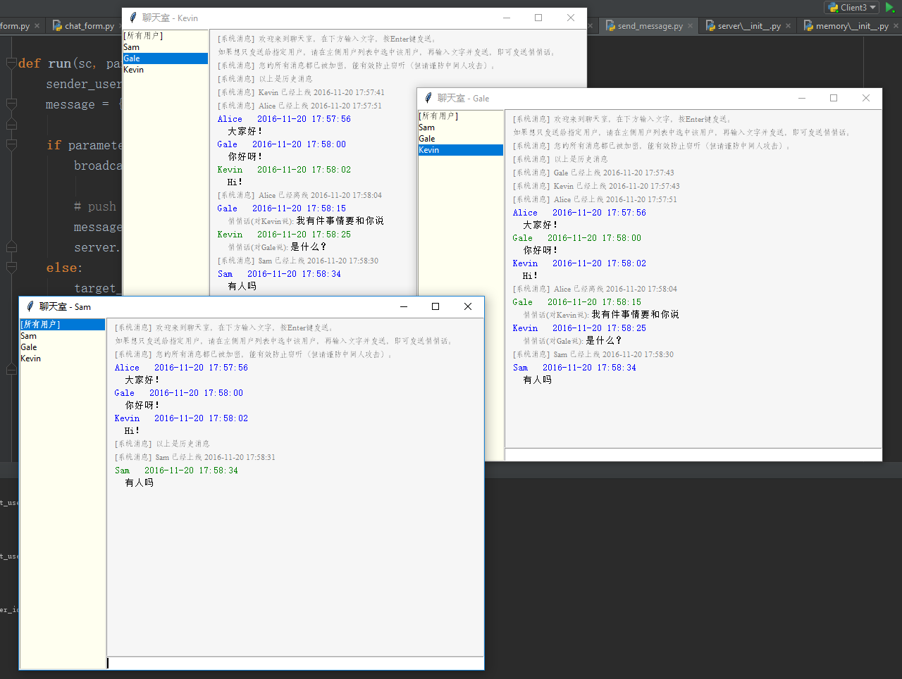

# 预览图


# 功能
- [x] Diffie-Hellman 密钥交换安全传输（启动时第一件事）
- [x] 用AES加密所有的传输内容
- [x] 包分为OpCode和Parameters，用binary序列化反序列化Parameters
- [x] 使用数据库存储用户信息、好友关系、房间信息、加入房间状态、所有聊天记录
- [x] tkinter GUI
- [x] 有新消息时自动滚动到底部
- [x] 窗口放大缩小
- [x] 服务器、客户端通过JSON文件配置
- [x] 联系人列表；按照最后发消息的时间排序好友和群；未读的消息用红点标注数量；显示并实时更新在线状态
- [x] 加好友功能，对方收到通知，通过/拒绝/推迟到下次登入时询问
- [x] 防止重复打开窗口，如果已经打开则使窗口获得焦点
- [x] 账号只能在一处登入，在别处登入时把原来登入的踢下线
- [x] 再次打开时恢复所有聊天记录、用户离线时收到的未读的消息用红点标注数量
- [x] 支持多行内容（Enter换行，Ctrl+Enter发送）；支持聊天字体的设置
- [x] 支持图片传输
- [x] 群聊功能、加群、创建群
- [x] 群聊中显示群成员（双击打开聊天窗口/发送好友请求）；实时显示群成员在线状态，置顶在线的成员
- [x] 智能的联系人列表中的最近消息（同QQ，群聊则显示发送者昵称，图片则显示[图片消息]，自动处理换行）


# 安装说明
Python版本: 3.5

pip install pycrypto # 用于AES加密

pip install Pillow # 支持JPG等格式图片的发送

# 运行方法
python run_client.py

python run_server.py

（一次只能运行一个server，但可以运行N个client）

# 配置文件
server和client共用```config.json```
```
    {
      "crypto": {
        "base": ..,
        "modulus": ...
      },
      "client": {
        "server_ip": "127.0.0.1",
        "server_port": 8111
      },
      "server": {
        "bind_ip": "0.0.0.0",
        "bind_port": 8111
      }
    }
```
大多都容易理解，需要注意的是```crypto```部分，这里的```base```和```modulus```是Diffie-Hellman密钥交换时用到的，应该为两个大素数。